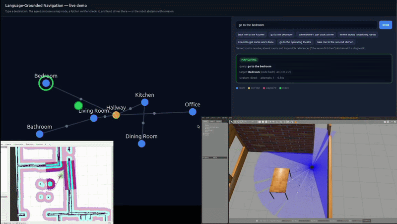
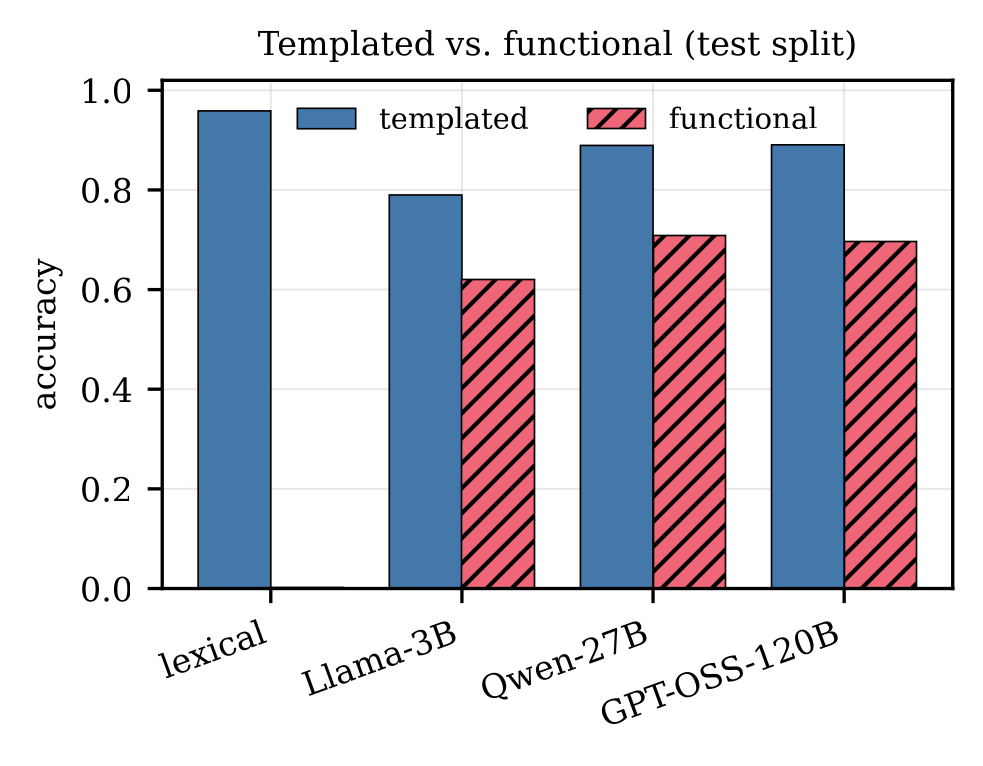
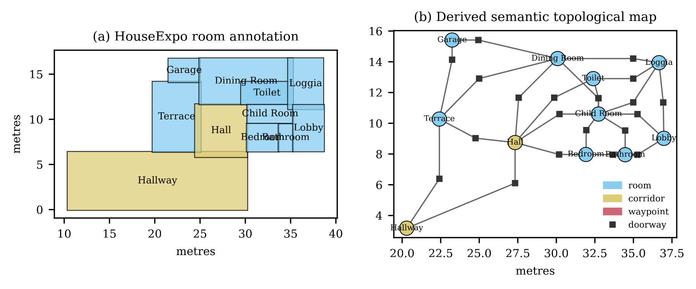
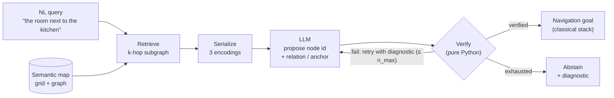
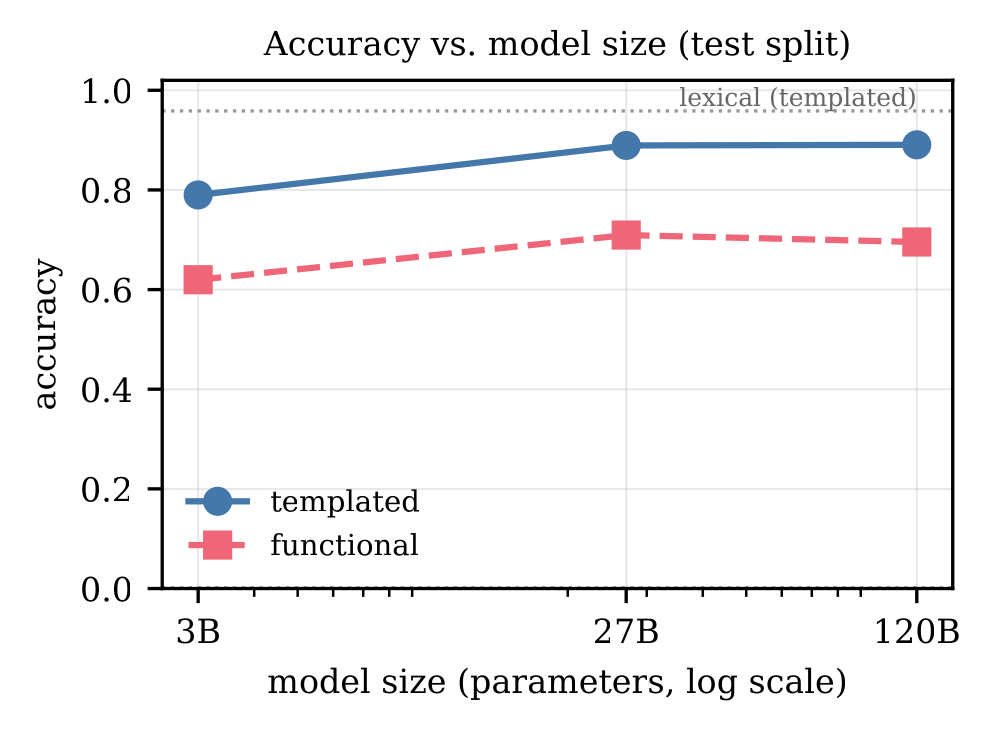
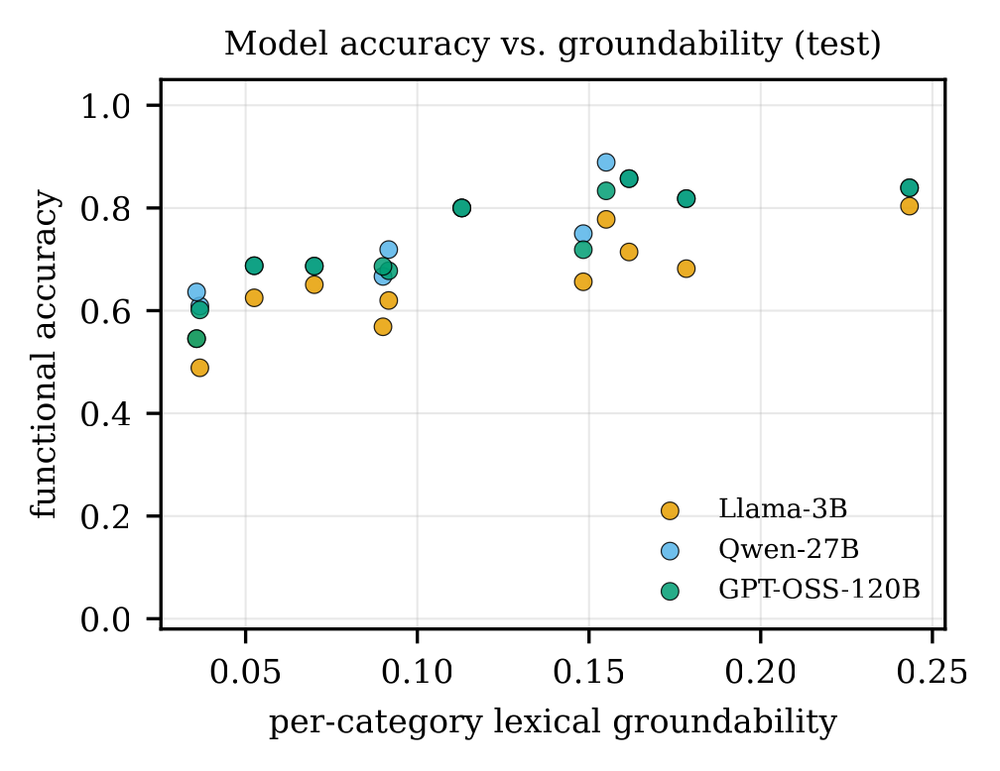
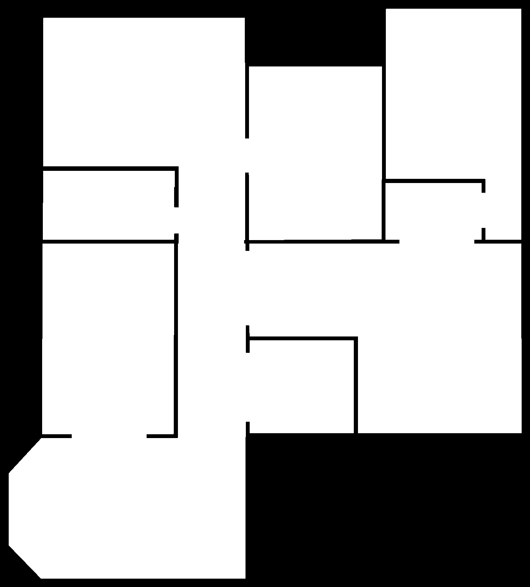

# Verify, or Abstain

**Structural grounding of language queries over semantic maps for indoor service robots.**

> The language model *proposes* a destination. A pure-Python verifier *disposes* — it checks the
> answer against the map and, when nothing grounds, the robot **refuses with a reason** instead of
> driving somewhere wrong.

<p align="center">
  
  <br/>
  <em>Type a destination in plain English → the agent resolves it to a map node, verifies it in pure Python, and Nav2 drives there — or abstains with a reason.</em>
</p>

<p align="center">
  
  &nbsp;&nbsp;
  
</p>


---

## What this is

Indoor navigation is solved in the lab, but *commissioning* a robot in a new building still means
running SLAM by hand, editing map files, and typing destination coordinates into config. The people
who know the building — a ward nurse, a warehouse supervisor — cannot do any of that.

This repository is the research code for an agent that lets a non-expert resolve **natural-language
destinations** against a **semantic map**, and — just as important — **refuse** when a request cannot
be grounded. An LLM reads a scoped slice of the map and returns *only a symbolic answer* (a node id,
and for relational queries a relation + anchor). A verifier written in ordinary Python checks that
answer against the map. Unverifiable answers are retried, then abstained on. **The LLM never emits a
path or coordinates** — metric planning stays with the classical stack.

### Headline result

| | Overall | Direct | Attribute | Abstention recall |
|---|:---:|:---:|:---:|:---:|
| single-pass 3B (no verify) | 0.40 | 0.99 | 0.96 | **0.00** |
| **+ structural verify** | **0.79** | 0.99 | 0.96 | **1.00** |

Verification lifts a 3B model **+39 points** on held-out queries — *entirely* by turning
hallucinations into honest abstentions. Additional retries add nothing. No second model judges the
first.

---

## How it works



**One query, end to end** (file · function):

1. `resolve()` receives the query, the map, and the LLM client — `src/agent.py`
2. Pick the retrieval anchor (robot's node, or best query-term match) — `agent._resolve_anchor`
3. Scope a k-hop subgraph + any node whose label/attributes match the query terms; trim to a token
   budget — `serialize.scoped_subgraph`
4. Render the subgraph to text (structured / relational / natural) — `serialize.ENCODERS`
5. Fill the versioned prompt — `prompts.resolve_v1`
6. Call the model → JSON `{node_id, target_phrase, relation, anchor}` — `src/llm.py`, `agent._parse`
7. **Build the proposal from the *query*, not the model's words** — the model only supplies `node_id`
8. Verify in pure Python: `node_exists` → `grounded`/`relation_holds` → `reachable` — `src/verify.py`
9. Route: verified → nav goal · fail → retry with the diagnostic · exhausted → **abstain**

The load-bearing invariant: the verifier is a pure function of **(query, proposed node, map)**. The
model's restatement is recorded for diagnostics but *never enters a predicate* — otherwise the model
would grade itself.

---

## Results

### 1 — A lexical baseline reframes the claim
On the **templated** benchmark, a no-LLM lexical resolver *wins* (0.96), because the benchmark's
ground truth is exactly what such a resolver computes. This is a property of the benchmark, not a
model failure — so templated accuracy alone cannot demonstrate the value of a language model.

### 2 — The functional stratum: the picture inverts
We add a **functional** stratum: 116 phrasings, frozen before measurement, that name a room by *what
one does there* ("somewhere to warm a baby's bottle" → kitchen), with no lexical route to the label.
There the result flips.

<p align="center">
  
  &nbsp;&nbsp;
  
</p>

| Functional stratum (test, n=647), verify-on | Accuracy | Abstains | Wrong | Correct |
|---|:---:|:---:|:---:|:---:|
| lexical (no model) | 0.002 | 646 | **0** | 1 |
| Llama-3B + verify | 0.62 | 0 | 246 | 401 |
| Qwen-27B + verify | 0.71 | 2 | 186 | 459 |
| GPT-OSS-120B + verify | 0.70 | 2 | 195 | 450 |

The lexical resolver **collapses to 0.002** — it refuses on 646/647 and gets *zero* wrong. The
language models supply the world knowledge it lacks. They fail in **disjoint** ways, which is exactly
the condition under which routing between them — guarded by one structural verifier — is safe.

---

## The semantic map & benchmark

A **semantic map** pairs a metric occupancy grid with an annotated topological graph. Nodes are typed
(room, corridor, doorway, junction, dock, waypoint), carry a label + semantic attributes + a metric
centroid; an edge is admitted only if the endpoints are reachable, so the graph never claims
connectivity the robot cannot realize.

**Benchmark strata** (ground truth computed deterministically, never model-generated):
`direct` · `attribute` · `relational` · `ungroundable` (correct answer = *abstain*) · `functional`.

### Dataset — HouseExpo

<p align="center"></p>

[HouseExpo](https://github.com/TeaganLi/HouseExpo) (Li et al., IROS 2020) is a large collection of 2D
indoor floor plans derived from SUNCG. Each plan gives an outer wall outline and per-category room
boxes with SUNCG labels — **but no doorways or connectivity**, which we infer geometrically (a doorway
where two boxes share a wall; edges are always room→doorway→room). We chose it because it is large and
diverse, 2D and light enough to run CPU-only, carries semantic room labels to ground against, and
forces us to *build* the topological graph rather than being handed one. We sample 400 plans (seed 0),
358 load, split 20/80 by plan → 797 templated + 647 functional test queries.

> The dataset is **not** committed (≈0.5 GB). Download it from the
> [HouseExpo repo](https://github.com/TeaganLi/HouseExpo) and place the plans under
> `data/houseexpo/` (JSON tarball under `HouseExpo/HouseExpo/json.tar.gz`).

---

## Repository layout

```
src/
  graph.py         node / edge / annotation datastructures, k-hop, shortest path
  serialize.py     graph -> text (3 encodings) + k-hop/lexical scoping under a token budget
  agent.py         the plan-retrieve-verify cycle: resolve()
  verify.py        pure-Python structural checks + diagnostics (the verifier)
  prompts.py       versioned prompt registry (resolve_v1)
  llm.py           unified Ollama / Groq client (OpenAI-compatible)
  benchmark.py     query generation + deterministic grading + templates
  houseexpo.py     HouseExpo floor plan -> semantic map
data/
  lexicon.py             SUNCG category -> semantic attributes (hand-authored)
  functional_queries.py  the frozen functional stratum (116 phrasings)
experiments/       run scripts, analysis, figures  (results/ holds the CSVs)
demo/              ROS 2 + Gazebo + Nav2 live demo (web console -> resolve/verify -> drive)
tests/             pytest suite (no test calls a real model)
```

---

## Getting started

```bash
git clone https://github.com/mahtabnewaz/verify-or-abstain.git
cd verify-or-abstain
python -m venv venv && source venv/bin/activate
pip install -r requirements.txt          # networkx, shapely, scikit-image, numpy, scipy, openai
cp .env.example .env                      # then add your GROQ_API_KEY (only for the hosted-model row)

pytest -q                                 # run the test suite (no real model is called)
```

**Local inference** uses [Ollama](https://ollama.com) (`ollama pull llama3.2:3b`); the large-model
comparison row uses Groq via an OpenAI-compatible endpoint. Keys live in `.env`, which is gitignored.

### Resolve a query in code

```python
from src.agent import resolve, AgentConfig
from src.llm import LLMClient
# build or load a SemanticMap `m` and a `query` object (text, stratum, query_terms, ...)
client = LLMClient("ollama", "llama3.2:3b")
result = resolve(query, m, client, AgentConfig(verify_enabled=True))
print(result.node_id, result.abstained)      # a node id, or an abstention with a diagnostic
```

---

## Reproducing the experiments

```bash
# generate the benchmark and inspect the strata
python -m experiments.run_ablation --mode pilot --models llama3.2:3b

# the no-model lexical control
python -m experiments.baseline_lexical

# functional stratum comparison + figures
python -m experiments.functional_compare
python -m experiments.figures
```

Every run writes a timestamped CSV with the full config in the header (`experiments/results/`).
All headline numbers are on the held-out **test** split; every finding was first established on tuning
and reproduced on test to within 0.04.

---

## Live demonstration (ROS 2 · Gazebo · Nav2)

`demo/` packages a Docker demo: a TurtleBot3 explores a house in Gazebo, `slam_toolbox` builds the
map, and a web console lets you type destinations in plain language. The research agent turns each
request into a **map node** or an **abstention with a reason**, and Nav2 drives to verified goals.

```bash
cd demo
xhost +local:docker
docker compose up -d --build
docker exec -it semantic_nav_demo bash /workspace/amr/demo/run_demo.sh   # web console: http://localhost:8088
```

See [`demo/README.md`](demo/README.md) for the full flow (mapping, saving a map, and localize mode).
Example queries: *"take me to the kitchen"* drives there; *"somewhere I can cook dinner"* resolves the
kitchen by intent; *"go to the operating theatre"* **abstains** — no such room.

---

## Design invariants

- The LLM never computes a path or emits coordinates — it returns node ids and symbolic relations.
- Verification is pure Python: set membership and graph reachability. No model judges another model.
- Benchmark ground truth is computed, never model-generated.
- Abstention is a correct, first-class output — never suppressed to raise accuracy.
- Every refusal carries a diagnostic naming the violated condition and the entity involved.

---

## Citation

```bibtex
@misc{newaz2025verifyorabstain,
  title  = {Verify, or Abstain: Structural Grounding of Language Queries
            over Semantic Maps for Indoor Service Robots},
  author = {Newaz, Mahtab and Lamya, Ramisa},
  year   = {2025},
  note   = {North South University}
}
```

## Acknowledgements

Built on [HouseExpo](https://github.com/TeaganLi/HouseExpo) (Li et al., IROS 2020). Local inference
via [Ollama](https://ollama.com); hosted comparison via [Groq](https://groq.com). ROS 2 / Nav2 /
`slam_toolbox` power the demonstration.
